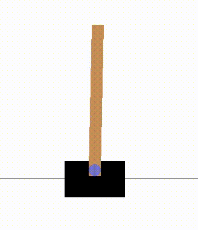

# CartpoleV1 - OpenAI Gym

## Double Deep Q Network

~~~
episode: 139, score:  221, epsilon: 0.0100, mean: 236.70
episode: 140, score:  215, epsilon: 0.0100, mean: 222.90
episode: 141, score:  222, epsilon: 0.0100, mean: 218.20
episode: 142, score:  221, epsilon: 0.0100, mean: 216.90
episode: 143, score:  250, epsilon: 0.0100, mean: 211.70
episode: 144, score:  274, epsilon: 0.0100, mean: 218.00
episode: 145, score:  299, epsilon: 0.0100, mean: 229.40
episode: 146, score:  500, epsilon: 0.0100, mean: 259.40
episode: 147, score: 2000, epsilon: 0.0100, mean: 440.70
episode: 148, score: 2000, epsilon: 0.0100, mean: 620.20
~~~
